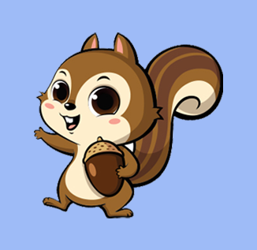

# 🥕 Default (디폴트)

## 👀 서비스 소개
* 서비스명: Vscode 테마 추천 
* 서비스설명: 
 

## 📅 프로젝트 기간
2022.08.16 ~ 2022.09.07 (3주)
 

## ⭐ 주요 기능
* 기능1
* 기능2
* 기능3
* 기능4
* 기능5
 

## ⛏👨‍💻기술스택👩‍💻
<table>
    <tr>
        <th>구분</th>
        <th>내용</th>
    </tr>
    <tr>
        <td>사용언어</td>
        <td>
            
            
            
            
        </td>
    </tr>
    <tr>
        <td>라이브러리</td>
        <td>
            
        </td>
    </tr>
    <tr>
        <td>개발도구</td>
        <td>
            
            
            
            
        </td>
    </tr>
    <tr>
        <td>서버환경</td>
        <td>
            
        </td>
    </tr>
    <tr>
        <td>데이터베이스</td>
        <td>
            
            
        </td>
    </tr>
    <tr>
        <td>협업도구</td>
        <td>
            
        </td>
    </tr>
</table>

 

## ⚙ 시스템 아키텍처(구조) 예시 

 

## 📌 SW유스케이스

 

## 📌 서비스 흐름도

 

## 📌 E-R Diagram

 

<!-- ## 🖥 화면 구성 -->
<!-- 시연영상 잘라서  -->

## 👨‍👩‍👦‍👦 팀원 역할
<table>
  <tr>
    <!-- 정충근 -->
    <td align="center"></td>
    <!-- 안지수 -->
    <td align="center"></td>
    <!-- 강성훈 -->
    <td align="center"></td>
    <!-- 양서현 -->
    <td align="center"></td>
    <!-- 김은지 -->
    <td align="center"></td>
    <!-- 김화영 -->
    <td align="center"></td>
  </tr>
  <tr>
    <td align="center"><strong>정충근</strong></td>
    <td align="center"><strong>안지수</strong></td>
    <td align="center"><strong>강성훈</strong></td>
    <td align="center"><strong>양서현</strong></td>
    <td align="center"><strong>김은지</strong></td>
    <td align="center"><strong>김화영</strong></td>
  </tr>
  <tr>
    <!-- 정충근 -->
    <td align="center"><b>Frontend</b></td>
    <!-- 안지수 -->
    <td align="center"><b>Frontend</b></td>
    <!-- 강성훈 -->
    <td align="center"><b>Backend</b></td>
    <!-- 양서현 -->
    <td align="center"><b>Backend</b></td>
    <!-- 김은지 -->
    <td align="center"><b>Deep Learning</b></td>
    <!-- 김화영 -->
    <td align="center"><b>Deep Learning</b></td>
  </tr>
  <tr>
    <!-- 정충근 -->
    <td align="center"><a href="https://github.com/PringlesHair" target='_blank'>github</a></td>
    <!-- 안지수 -->
    <td align="center"><a href="https://github.com/Scarlett0JS" target='_blank'>github</a></td>
    <!-- 강성훈 -->
    <td align="center"><a href="https://github.com/tmxjvm5" target='_blank'>github</a></td>
    <!-- 양서현 -->
    <td align="center"><a href="https://github.com/pyth1007" target='_blank'>github</a></td>
    <!-- 김은지 -->
    <td align="center"><a href="https://github.com/eunji78" target='_blank'>github</a></td>
    <!-- 김화영 -->
    <td align="center"><a href="https://github.com/dotoritoring" target='_blank'>github</a></td>
  </tr>
</table>

## 🤾‍♂️ 트러블슈팅
개념: 문제 해결을 위해 문제의 원인을 논리적이고 체계적으로 찾는 일이며 제품이나 프로세스의 운영을 재개
프로젝트 진행하는 동안 발생했던 이슈 중 가장 기억에 남았던 문제와 해결 프로세스 나열(2~5가지 정도)
  
* 문제1 
 문제점 설명 및 해결방안
 
* 문제2 
 문제점 설명 및 해결방안
